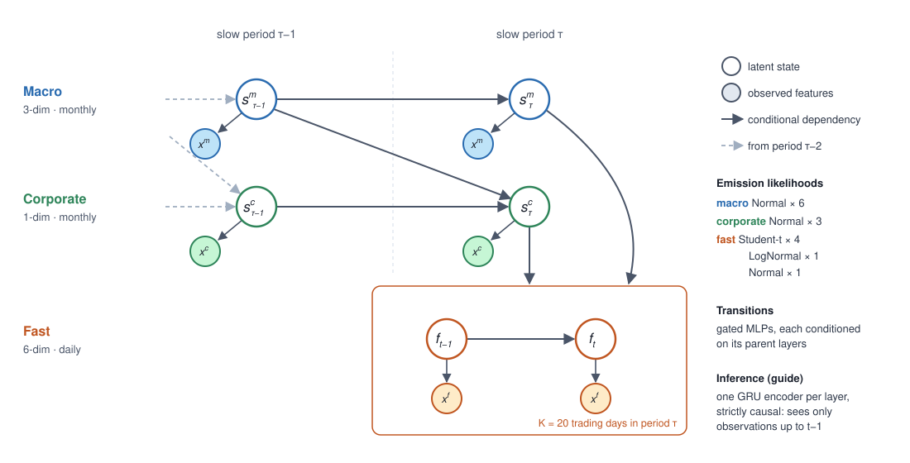
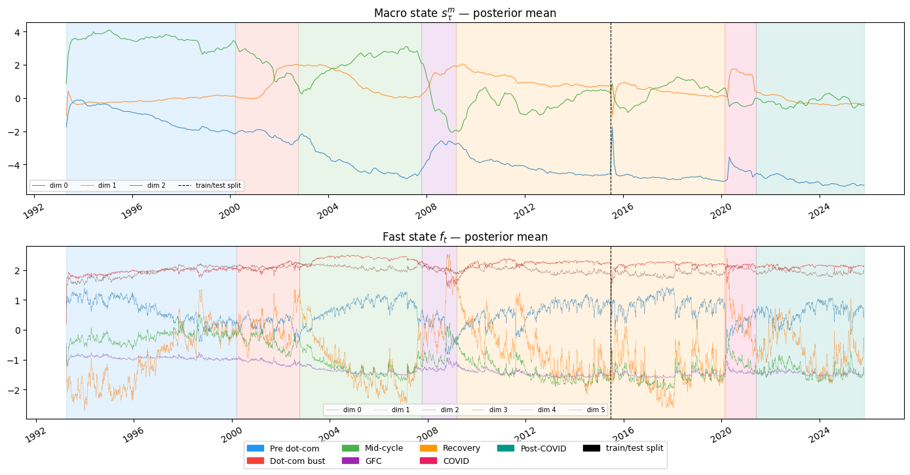
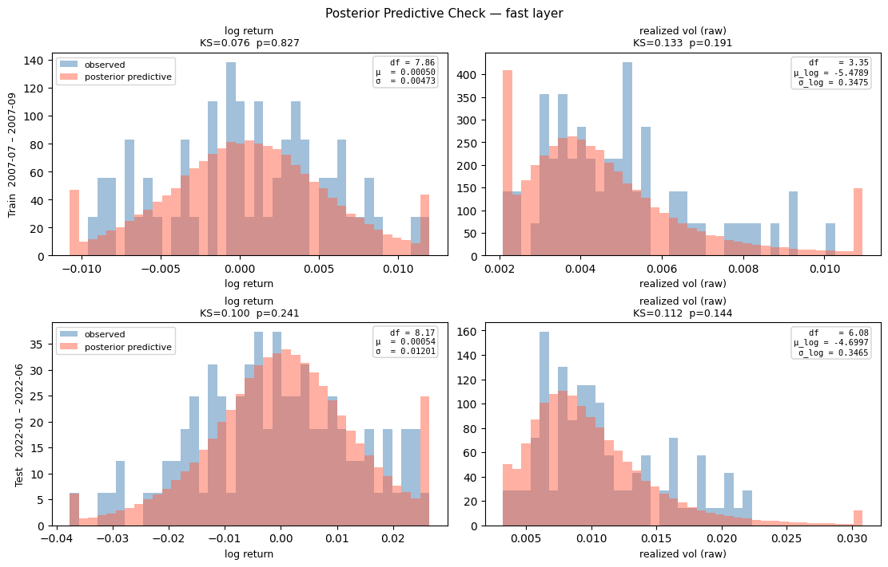

# Hierarchical Deep Markov Model for Financial Markets

A three-timescale Deep Markov Model (DMM) built in PyTorch + Pyro that learns latent market states at
**monthly macro**, **monthly corporate-fundamental**, and **daily price** resolution, trained end-to-end
with stochastic variational inference.

The project was built incrementally, each step motivated by the limits of the previous one:

```
HMM baseline  →  flat DMM  →  DMM with mixed emissions  →  two-scale NestedDMM  →  three-scale TripleDMM
```

## Model

**TripleDMM** ([dmm_triple.py](dmm_triple.py)) has three latent processes, with information flowing down the
hierarchy from slow to fast:



| Latent | Dim | Frequency | Transition conditioned on |
|---|---|---|---|
| `sm` — macro regime | 3 | monthly (K = 20 trading days) | previous `sm` |
| `sc` — corporate fundamentals | 1 | monthly | previous `sc` + previous `sm` |
| `f` — fast market state | 6 | daily | previous `f` + current `sc` + current `sm` |

- **Transitions:** gated transitions (in the style of Krishnan et al., 2017), each conditioned on its parent layers.
- **Emissions:** a `MixedEmitter` gives every feature group a matching likelihood: **Student-t** for heavy-tailed
  daily features (log return, log Rogers–Satchell volatility, log VIX, overnight gap), **LogNormal** for realized
  downside semivariance, and **Normal** for detrended volume and the macro/corporate series.
- **Inference:** a strictly causal guide. Separate GRU encoders for each layer see only observations up to `t-1`,
  so the posterior at day `t` uses no future information. That makes the latents safe to use as features downstream.
  An earlier backward-RNN (smoothing) guide is kept in [archive/dmm_nested_bwd.py](archive/dmm_nested_bwd.py) for comparison.
- **Training:** `Trace_ELBO`, Adam (lr 1e-3), windows of 5 slow periods (100 trading days). The ELBO is split into
  reconstruction and KL terms for each layer to watch for posterior collapse. Total size is about 42.5k parameters.

### Data

| Layer | Features | Source |
|---|---|---|
| Fast (daily) | log return, log RS realized vol, log VIX, overnight gap, 5-day downside semivariance, detrended log volume | SPY OHLCV (Yahoo Finance), VIX (Cboe, via FRED) |
| Corporate | EPS YoY growth, payout ratio, earnings yield | S&P 500 quarterly EPS / DPS (S&P Dow Jones Indices) |
| Macro | 10Y–3M term spread, BAA–10Y credit spread, 2Y yield, jobless claims YoY, CPI YoY (lagged for publication), consumer sentiment | FRED |

The full list of sources, series IDs and date ranges is in [data/README.md](data/README.md).

**Split:** train 1993-03 → 2015-06 (5,600 trading days, 280 months). Test 2015-06 → 2025-10 (2,600 days, 130 months).
Normalization constants are fit on the training set only.

### Diagnostics

[dmm_triple_diagnostics.ipynb](dmm_triple_diagnostics.ipynb) covers training, inference, and evaluation:
- ELBO curves broken down into per-layer reconstruction and KL terms
- PCA of the macro and fast latents, colored by market regime, realized-vol quartile, and rolling return
- Time series of the corporate latent and all posterior means
- Posterior predictive checks on the fast layer (Kolmogorov–Smirnov tests per feature)



*Posterior means of the macro (top) and fast (bottom) latents, with market regimes shaded. The macro state shifts at
the dot-com bust, the 2008 financial crisis and COVID. COVID falls in the test period, so the model was never trained
on it. The spike at the dashed train/test line is expected: inference on the test set is a separate run that starts
from the learned initial state and fresh GRU encoder states, rather than continuing from the end of training. It
settles within a few months.*



*Observed vs. posterior-predictive distributions for daily log return and realized volatility, on a training window
(Jul–Sep 2007) and a test window (Jan–Jun 2022). The KS test does not reject the fit for any of the four panels
(p = 0.14–0.83). The learned Student-t degrees of freedom for returns (about 8) reflect fat tails.*

The notebook exports [dmm_artifacts.npz](dmm_artifacts.npz): posterior means and standard deviations for all three
latents plus the per-day emission parameters, for both train and test.

## Repository layout

```
dmm_triple.py                  TripleDMM model (final)
dmm_triple_diagnostics.ipynb   Features, training, inference, diagnostics, artifact export
dmm_nested.py                  Two-scale NestedDMM (slow/fast)
dmm_nested_diagnostics.ipynb
hmm_multivariate.ipynb         Multivariate Gaussian HMM baseline + stationarity / Hurst analysis
utils.py                       Realized-vol estimators, semivariance, HMM plotting helpers
fetch_data.py                  Downloads SPY + FRED series into data/
dmm_artifacts.npz              Trained model outputs (latents + emission parameters)
data/                          Raw market and macro data
figures/                       Architecture diagram and README figures
archive/                       Earlier iterations: univariate HMM, flat DMM, mixed-emission DMM,
                               backward-guide NestedDMM
```

## Running

```bash
pip install -r requirements.txt
jupyter notebook dmm_triple_diagnostics.ipynb
```

The data is already in `data/`. To re-download it, get a free
[FRED API key](https://fred.stlouisfed.org/docs/api/api_key.html) and run:

```bash
FRED_API_KEY=your_key python fetch_data.py
```

## Data sources

- **Market prices:** SPY daily OHLCV from Yahoo Finance, retrieved with [`yfinance`](https://github.com/ranaroussi/yfinance).
- **Macro and rates:** FRED, Federal Reserve Bank of St. Louis: T10Y3M, BAA10Y, DGS2, DGS10, ICSA, CPIAUCSL,
  UMCSENT, VIXCLS. The original publishers include the Federal Reserve Board, BLS, the U.S. Employment and Training
  Administration, Moody's, the University of Michigan, and Cboe.
- **Corporate fundamentals:** S&P 500 quarterly EPS and DPS from S&P Dow Jones Indices.

The data files are included for reproducibility and keep their providers' terms. See [data/README.md](data/README.md).

## License

The code is released under the [MIT License](LICENSE). The data in `data/` is not covered by it.
